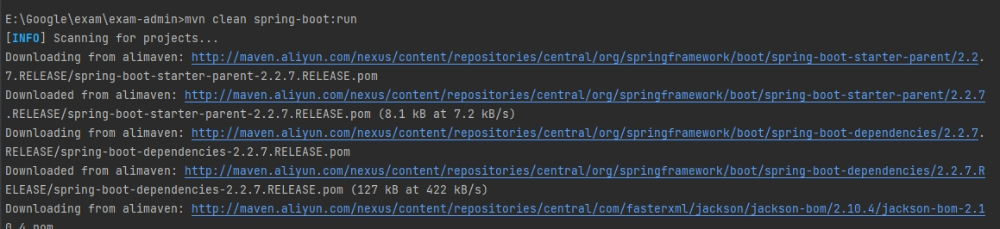
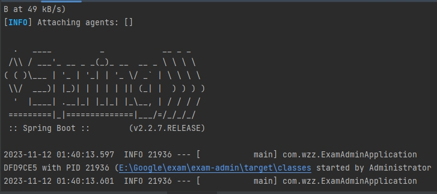
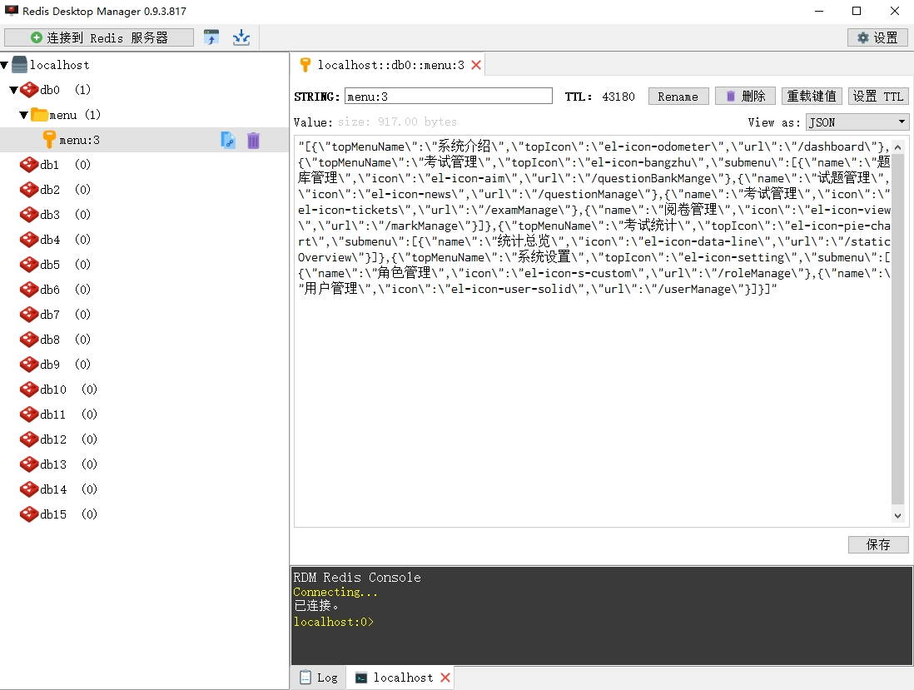
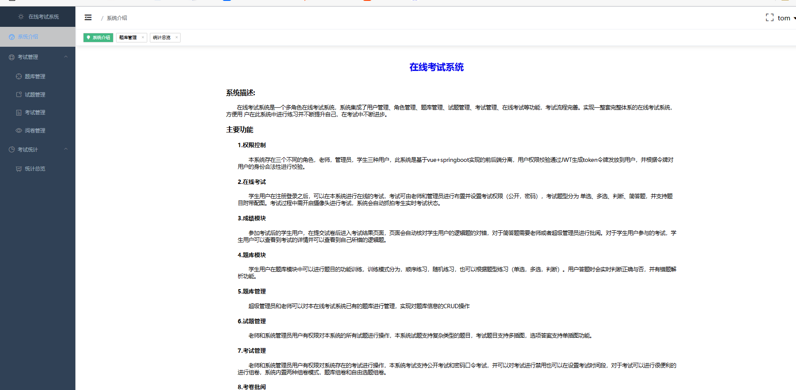
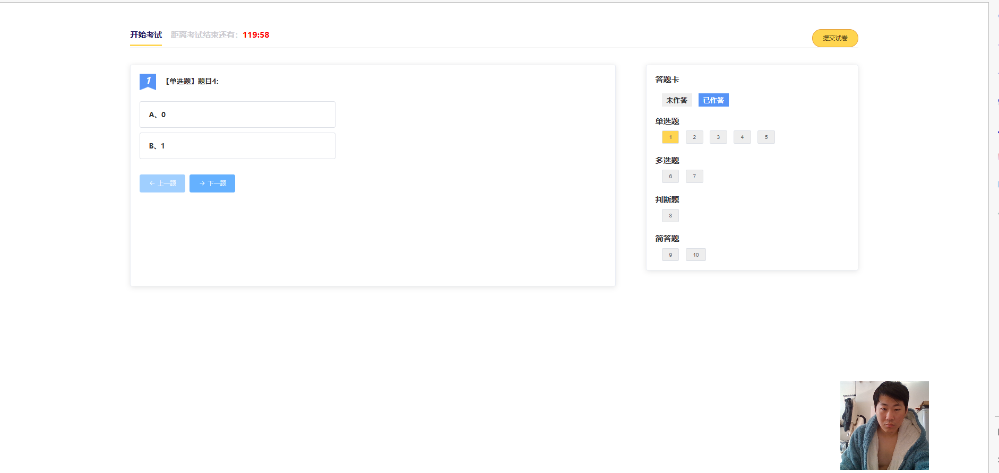
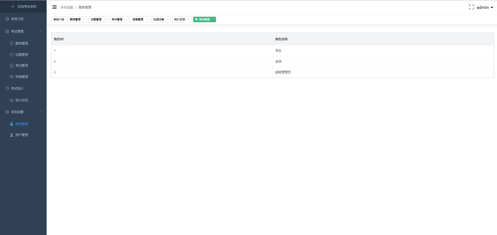
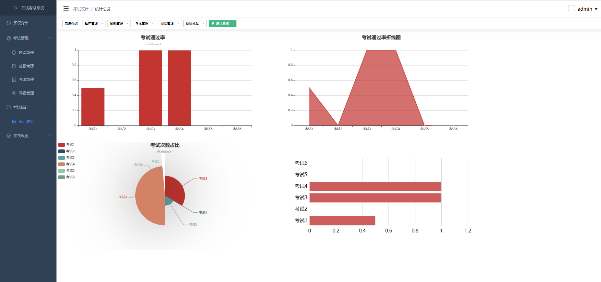
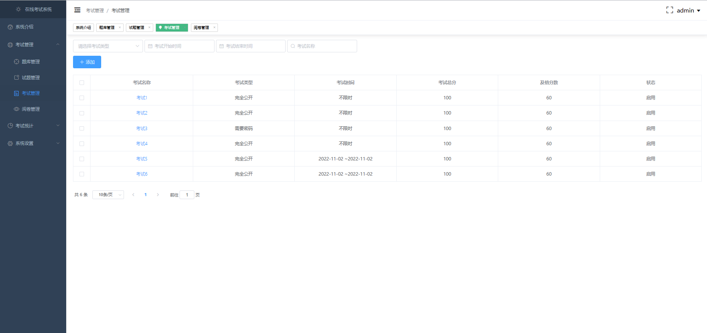
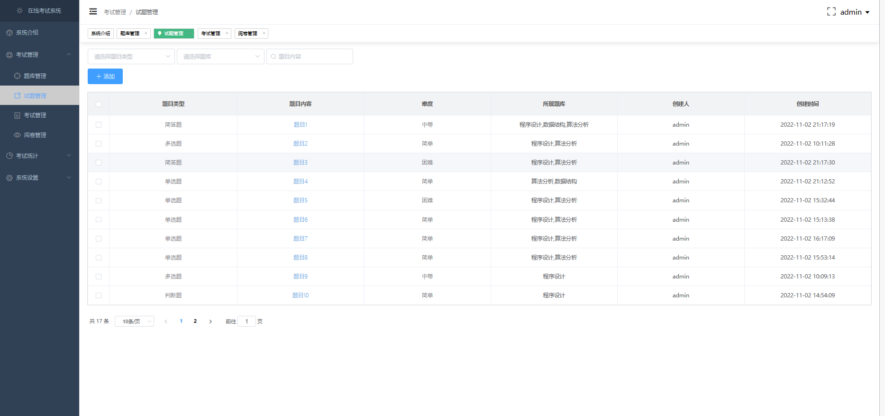

<p align="center">
    <a href='https://docs.oracle.com/en/java/javase/8'></a>
    <a href='https://docs.spring.io/spring-boot/docs/2.6.2-SNAPSHOT/reference/html'></a>
    <a href='https://staging-cn.vuejs.org'></a><br/>
    <a href='#'></a>
    <a href='#'></a>
    <a href='#'></a>
    <a href='#'></a>
</p>

# 在线考试系统

#### 开发环境

+ Windows

#### 配置环境

| 程序           | 版本        | 说明                       |
|--------------|-----------|--------------------------|
| Jdk          | 1.8.0 161 | Java 开发工具包               |
| Mysql        | 5.5.27    | 关系型数据库                   |
| Redis        | 7.0.5     | 非关系型数据库                  |
| Apache-maven | 3.9.0     | Java 项目管理和构建工具           |
| Nvm          | 1.10      | Node.js 版本管理器            |
| Node         | 8.12.0    | Node.js JavaScript 运行时环境 |

#### 开发工具

| 工具                       | 版本            | 说明                      |
|--------------------------|---------------|-------------------------|
| IDEA                     | 2022.3.2      | 后前端开发IDE                |
| Git                      | 2.24.1        | 代码托管平台                  |
| Google   Chrome          | 75.0.3770.100 | 浏览器、前端调试工具              |
| Navicat                  | 11.1.13       | 数据库连接工具                 |
| Postman                  | 7.1.0         | 接口测试工具                  |
| VMware   Workstation Pro | 14.1.3        | 虚拟机(未用到或许你会用到)          |
| PowerDesigner            | 15            | 数据库设计工具(未用到或许你会用到)      |
| SQLyog                   | 12.0.3        | 数据库连接工具 (未用到或许你会用到)     |
| Visio                    | 2013          | 时序图、流程图等绘制工具(未用到或许你会用到) |
| ProcessOn                | ——            | 架构图等绘制工具(未用到或许你会用到)     |
| XMind   ZEN              | 9.2.0         | 思维导图绘制工具(未用到或许你会用到)     |
| RedisDesktop             | 0.9.3.817     | redis客户端连接工具(未用到或许你会用到) |

#### 编码规范

- 规范方式：严格遵守阿里编码规约。
- 命名统一：简介最大程度上达到了见名知意。
- 分包明确：层级分明可快速定位到代码位置。
- 注释完整：描述性高大量减少了开发人员的代码阅读工作量。
- 工具规范：使用统一jar包避免出现内容冲突。
- 代码整洁：可读性、维护性高。

#### 包的结构
```
- exam -- 整个项目
|   +- .idea -- 存放项目的IDE配置文件
|   +- exam-admin -- 考试管理模块
|   |   +- .idea -- 存放考试管理模块的IDE配置文件
|   |   +- pom.xml -- Maven项目配置文件
|   |   +- src -- 存放源代码的目录
|   |   |   +- main -- 主要的源代码目录
|   |   |   |   +- java -- Java源代码目录
|   |   |   |   |   +- com.wzz -- 项目的根包名
|   |   |   |   |   |   +- config -- 配置文件目录
|   |   |   |   |   |   |   +- AdminInterceptor.java -- 管理员拦截器，用于拦截管理员相关请求
|   |   |   |   |   |   |   +- CorsConfig.java -- 跨域配置，用于允许跨域请求
|   |   |   |   |   |   |   +- DruidConfig.java -- Druid数据源配置，用于配置数据库连接池
|   |   |   |   |   |   |   +- MybatisPlusConfig.java -- MyBatis Plus配置，用于配置MyBatis Plus相关功能
|   |   |   |   |   |   |   +- RedisConfig.java -- Redis配置，用于配置Redis连接和操作
|   |   |   |   |   |   |   +- StudentInterceptor.java -- 学生拦截器，用于拦截学生相关请求
|   |   |   |   |   |   |   +- SwaggerConfig.java -- Swagger配置，用于生成API文档
|   |   |   |   |   |   |   +- TeacherInterceptor.java -- 教师拦截器，用于拦截教师相关请求
|   |   |   |   |   |   |   +- WebAppConfigurer.java -- Web应用配置，用于配置Web应用相关设置
|   |   |   |   |   |   |   +- controller -- 控制器
|   |   |   |   |   |   |   |   +- AdminController.java -- 管理员相关的控制器
|   |   |   |   |   |   |   |   +- CommonController.java -- 通用的控制器
|   |   |   |   |   |   |   |   +- StudentController.java -- 学生相关的控制器
|   |   |   |   |   |   |   |   +- TeacherController.java -- 教师相关的控制器
|   |   |   |   |   |   |   |   +- UtilController.java -- 实用工具相关的控制器
|   |   |   |   |   |   |   +- entity -- 实体
|   |   |   |   |   |   |   |   +- Answer.java -- 答案实体类
|   |   |   |   |   |   |   |   +- Exam.java -- 考试实体类
|   |   |   |   |   |   |   |   +- ExamQuestion.java -- 考试题目实体类
|   |   |   |   |   |   |   |   +- ExamRecord.java -- 考试记录实体类
|   |   |   |   |   |   |   |   +- Question.java -- 题目实体类
|   |   |   |   |   |   |   |   +- QuestionBank.java -- 题库实体类
|   |   |   |   |   |   |   |   +- User.java -- 用户实体类
|   |   |   |   |   |   |   |   +- UserRole.java -- 用户角色实体
|   |   |   |   |   |   |   +- ExamAdminApplication.java -- 应用程序的入口点，用于启动整个应用程序
|   |   |   |   |   |   |   +- mapper -- 数据库映射接口目录
|   |   |   |   |   |   |   |   +- AnswerMapper.java -- 答案实体类的数据库映射接口，用于与数据库进行交互
|   |   |   |   |   |   |   |   +- ExamMapper.java -- 考试实体类的数据库映射接口，用于与数据库进行交互。
|   |   |   |   |   |   |   |   +- ExamQuestionMapper.java -- 考试题目实体类的数据库映射接口，用于与数据库进行交互。
|   |   |   |   |   |   |   |   +- ExamRecordMapper.java -- 考试记录实体类的数据库映射接口，用于与数据库进行交互。
|   |   |   |   |   |   |   |   +- QuestionBankMapper.java -- 题库实体类的数据库映射接口，用于与数据库进行交互。
|   |   |   |   |   |   |   |   +- QuestionMapper.java -- 题目实体类的数据库映射接口，用于与数据库进行交互。
|   |   |   |   |   |   |   |   +- UserMapper.java -- 用户实体类的数据库映射接口，用于与数据库进行交互。
|   |   |   |   |   |   |   |   +- UserRoleMapper.java -- 用户角色实体类的数据库映射接口，用于与数据库进行交互。
|   |   |   |   |   |   |   +- service -- 服务接口目录
|   |   |   |   |   |   |   |   +- AnswerService.java -- 答案相关的服务接口，定义了答案相关的业务逻辑。
|   |   |   |   |   |   |   |   +- ExamQuestionService.java -- 考试题目相关的服务接口，定义了考试题目相关的业务逻辑。
|   |   |   |   |   |   |   |   +- ExamRecordService.java -- 考试记录相关的服务接口，定义了考试记录相关的业务逻辑。
|   |   |   |   |   |   |   |   +- ExamService.java -- 考试相关的服务接口，定义了考试相关的业务逻辑。
|   |   |   |   |   |   |   |   +- impl -- 服务接口实现类目录
|   |   |   |   |   |   |   |   |   +- AnswerServiceImpl.java -- 答案相关的服务接口的实现类，实现了答案相关的业务逻辑。
|   |   |   |   |   |   |   |   |   +- ExamQuestionServiceImpl.java -- 考试题目相关的服务接口的实现类，实现了考试题目相关的业务逻辑。
|   |   |   |   |   |   |   |   |   +- ExamRecordServiceImpl.java -- 考试记录相关的服务接口的实现类，实现了考试记录相关的业务逻辑。
|   |   |   |   |   |   |   |   |   +- ExamServiceImpl.java -- 考试相关的服务接口的实现类，实现了考试相关的业务逻辑。
|   |   |   |   |   |   |   |   |   +- QuestionBankServiceImpl.java -- 题库相关的服务接口的实现类，实现了题库相关的业务逻辑。
|   |   |   |   |   |   |   |   |   +- QuestionServiceImpl.java -- 题目相关的服务接口的实现类，实现了题目相关的业务逻辑。
|   |   |   |   |   |   |   |   |   +- UserRoleServiceImpl.java -- 用户角色相关的服务接口的实现类，实现了用户角色相关的业务逻辑。
|   |   |   |   |   |   |   |   |   +- UserServiceImpl.java -- 用户相关的服务接口的实现类，实现了用户相关的业务逻辑。
|   |   |   |   |   |   |   |   +- QuestionBankService.java -- 题库相关的服务接口，定义了题库相关的业务逻辑。
|   |   |   |   |   |   |   |   +- QuestionService.java -- 题目相关的服务接口，定义了题目相关的业务逻辑。
|   |   |   |   |   |   |   |   +- UserRoleService.java -- 用户角色相关的服务接口，定义了用户角色相关的业务逻辑
|   |   |   |   |   |   |   |   +- UserService.java -- 用户相关的服务接口，定义了用户相关的业务逻辑。
|   |   |   |   |   |   |   +- Util -- 实用工具目录
|   |   |   |   |   |   |   |   +- CheckToken.java -- 检查令牌有效性的工具类。
|   |   |   |   |   |   |   |   +- createVerificationCode.java -- 生成验证码的工具类。
|   |   |   |   |   |   |   |   +- OSSUtil.java -- OSS 工具类。
|   |   |   |   |   |   |   |   +- RedisUtil.java -- Redis 工具类。
|   |   |   |   |   |   |   |   +- SaltEncryption.java -- 加密工具类。
|   |   |   |   |   |   |   |   +- TokenUtils.java -- 令牌工具类。
|   |   |   |   |   |   |   +- vo -- 值对象目录
|   |   |   |   |   |   |   |   +- AddExamByBankVo.java -- 根据题库添加考试时的请求参数对象。
|   |   |   |   |   |   |   |   +- AddExamByQuestionVo.java -- 根据题目添加考试时的请求参数对象。
|   |   |   |   |   |   |   |   +- BankHaveQuestionSum.java -- 题库包含的题目数量信息对象。
|   |   |   |   |   |   |   |   +- CommonResult.java -- 通用响应结果对象。
|   |   |   |   |   |   |   |   +- ExamQueryVo.java -- 考试查询请求参数对象。
|   |   |   |   |   |   |   |   +- QuestionVo.java -- 题目信息对象。
|   |   |   |   |   |   |   |   +- TokenVo.java -- 令牌信息对象。
|   |   |   |   +- resources -- 资源文件目录
|   |   |   +- test -- 测试代码目录
|   |   |   |   +- java -- Java 测试代码目录
|   |   |   |   |   +- com
|   |   |   |   |   |   +- wzz -- 测试代码包名
|   |   |   |   |   |   |   +- ExamAdminApplicationTests.java -- 应用程序测试类，用于测试应用程序的正确性。
|   |   +- target -- 构建输出目录
|   +- exam-vue -- 项目前端
|   |   +- .browserslistrc -- 浏览器兼容性配置文件。
|   |   +- .editorconfig -- 编辑器配置文件。
|   |   +- .eslintrc.js -- ESLint 配置文件。
|   |   +- .gitignore -- Git 忽略文件列表。
|   |   +- babel.config.js -- Babel 配置文件。
|   |   +- debug.log -- 调试日志文件。
|   |   +- dist -- 前端构建输出目录
|   |   |   +- css -- CSS 样式文件目录。
|   |   |   +- favicon.ico -- 网站图标文件。
|   |   |   +- fonts -- 字体文件目录。
|   |   |   +- img -- 图片文件目录。
|   |   |   +- index.html -- 前端应用程序主页面。
|   |   |   +- js -- JavaScript 脚本文件目录。
|   |   +- node_modules -- Node.js 模块目录。
|   |   +- package-lock.json -- NPM 包依赖版本锁定文件。
|   |   +- package.json -- NPM 包管理配置文件。
|   |   +- public -- 前端公共资源目录
|   |   |   +- favicon.ico -- 网站图标文件。
|   |   |   +- index.html -- 前端应用程序主页面模板文件。
|   |   +- src -- 前端源代码目录
|   |   |   +- api -- 前端 API 目录
|   |   |   |   +- api.js -- 前端 API 定义文件，用于与后端进行交互。
|   |   |   +- App.vue -- Vue.js 应用程序的根组件。
|   |   |   +- assets -- 前端资源目录
|   |   |   |   +- css -- CSS 样式文件目录。
|   |   |   |   +- imgs -- 图片文件目录。
|   |   |   |   +- logo.png -- 前端应用程序的 Logo 图片文件。
|   |   |   +- components -- Vue.js 组件目录。
|   |   |   +- main.js -- Vue.js 应用程序的入口文件。
|   |   |   +- plugins -- Vue.js 插件目录
|   |   |   |   +- element.js -- Element UI 插件定义文件。
|   |   |   +- Vue.js 路由目录
|   |   |   |   +- Vue.js 路由定义文件。
|   |   +- vue.config.js -- Vue CLI 配置文件。
|   +- README.md -- 项目的说明文档。
|   +- sql -- 数据库脚本目录
|   |   +- exam_system.sql -- 考试系统的数据库脚本。
|   +- 图片
```

#### 后端技术栈

| 技术                             | 版本            | 说明                          |
|--------------------------------|---------------|-----------------------------|
| Spring Boot Starter Parent     | 2.2.7.RELEASE | Spring Boot 父依赖版本       |
| Spring Boot Starter Web        | -             | Spring Boot Web Starter       |
| MySQL Connector/J              | -             | MySQL 数据库驱动              |
| Log4j                          | 1.2.17        | 日志框架                      |
| Aliyun SDK OSS                 | 2.8.2         | 阿里云对象存储 SDK            |
| Lombok                         | -             | Java 实用工具库               |
| Java JWT                       | 3.8.2         | JSON Web Token 实现库         |
| Springfox Swagger2             | 2.9.2         | Swagger API 文档生成器        |
| Springfox Swagger UI           | 2.9.2         | Swagger UI 页面               |
| Druid                          | 1.1.22        | 数据库连接池                  |
| Spring Boot Starter Data Redis | -             | Redis Starter                 |
| MyBatis Plus                   | 3.0.5         | MyBatis 增强工具              |
| Spring Boot Starter Test       | -             | Spring Boot 测试 Starter      |

#### 前端技术栈

| 技术                             | 版本      | 说明                                             |
|--------------------------------|---------|------------------------------------------------|
| axios                          | ^0.20.0 | 基于 Promise 的 HTTP 请求客户端，可用于浏览器和 node.js |
| core-js                        | ^3.6.5  | JavaScript 标准库的模块化实现                         |
| echarts                        | ^4.9.0  | 强大、交互式的图表和可视化库                         |
| element-ui                     | ^2.4.5  | 面向 Web 的 Vue.js 2.0 UI 组件库                     |
| node-sass                      | ^4.14.1 | libsass 的 Node.js 封装                              |
| sass-loader                    | ^10.0.3 | 加载 Sass/SCSS 文件并将其编译为 CSS                   |
| vue                            | ^2.6.11 | 逐渐被采用的渐进式 JavaScript 框架，用于构建 Web 上的 UI |
| vue-router                     | ^3.2.0  | Vue.js 的官方路由器                                 |
| @vue/cli-plugin-babel          | ~4.5.0  | Vue CLI 的 Babel 插件                              |
| @vue/cli-plugin-eslint        | ~4.5.0  | Vue CLI 的 ESlint 插件                             |
| @vue/cli-plugin-router        | ~4.5.0  | Vue CLI 的 Vue Router 插件                         |
| @vue/cli-service              | ~4.5.0  | 用于开发和构建的本地服务                             |
| @vue/eslint-config-standard   | ^5.1.2  | JavaScript Standard Style 的 ESLint 可共享配置       |
| babel-eslint                  | ^10.1.0 | ESLint 的自定义解析器                                |
| babel-plugin-component         | ^1.1.1  | 可定制的模块化 babel 插件，用于按需导入 Element-UI 组件 |
| eslint-plugin-import          | ^2.20.2 | 帮助验证正确导入的 ESLint 插件                        |
| eslint-plugin-node            | ^11.1.0 | Node.js 的其他 ESLint 规则                           |
| eslint-plugin-promise         | ^4.2.1  | 强制执行 JavaScript promises 的最佳实践             |
| eslint-plugin-standard        | ^4.0.0  | JavaScript 社区标准的 ESLint 插件                     |
| eslint-plugin-vue             | ^6.2.2  | Vue.js 官方的 ESLint 插件                            |
| vue-cli-plugin-element        | ^1.0.1  | Element-UI 的 Vue CLI 插件                          |
| vue-template-compiler         | ^2.6.11 | 将 Vue.js 模板编译成渲染函数的编译器                  |

#### 安装教程
1.  在navicat中运行数据库脚本生成对应的数据库表
2.  在src/main/resources/application.yml文件里更改数据库(Redis/Mysql)名称或数据库密码
3.  在pom.xml文件的父目录运行 mvn clean spring-boot:run 启动后端
4.  启动前端 你可以在package.json的父目录执行下如命令 或者 直接在IDEA里点击也可运行 值得一提的是后两命令分别是打包命令和检查修复命令

```
npm install
```
```
npm run serve
```
```
npm run build
```
```
npm run lint
```
+ 如下图所示







#### 登录账户

用户名：admin
密码：12345

#### 截图














